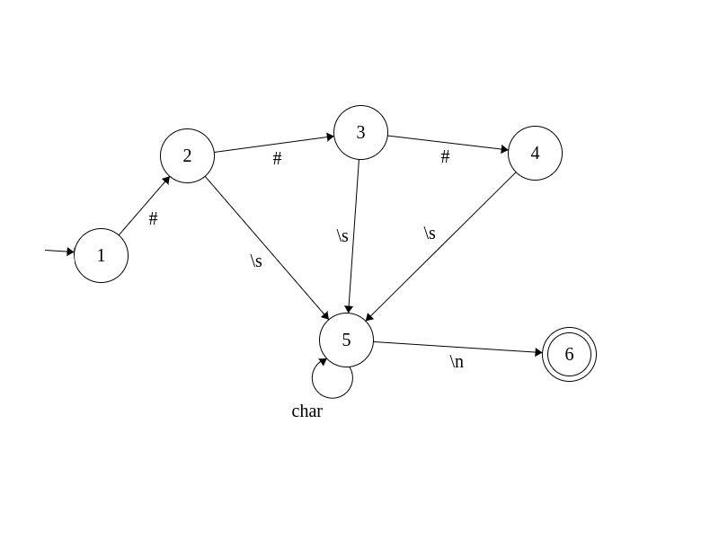
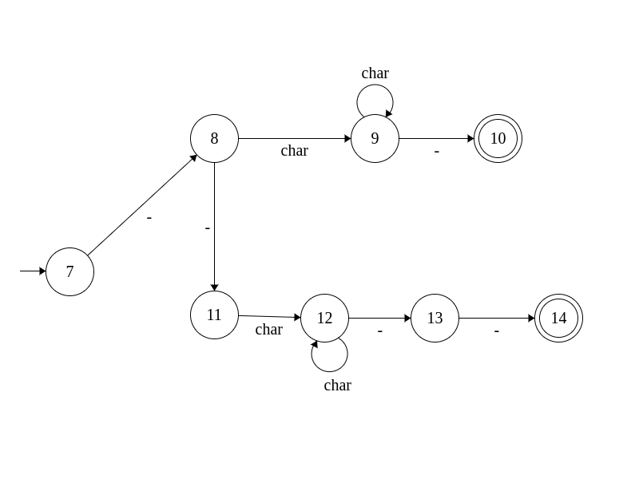

Markdown To Latex
=================

---

-	[x] Acerca de Markdown
-	[x] Comparación Latex-Markdown
	-	[ ] Imagenes paraleras de codigo
-	[x] Análisis léxico
	-	[x] tokens
	-	[ ] Expresiones regulares
	-	[x] Automata
	-	[ ] Codigo en C
-	[ ] Análisis sintáctico
	-	[x] Gramatica
-	[ ] Imagen de un cuyi

Acerca de Markdown
------------------

Es un lenguaje de marcado creado para escribir en la web de tal manera que es fácil de editar y de leer a la vez.

Usualmente todo texto escito en Markdown se suele compilar en HTML, un compilador de Markdown a Latex nos serviría de utilidad para publicar un informe en la web como para presentarlo formalmente en un informe.

Comparación
-----------

| Tamaño Encabezado | Latex                         | Markdown  |
|-------------------|-------------------------------|-----------|
| 1                 | \section{section}             | # h1      |
| 2                 | \subsection{subsection}       | ## h2     |
| 3                 | \subsubsection{subsubsection} | ### h3    |
| 4                 | \paragraph{paragraph}         | #### h4   |
| 5                 | \subparagraph{subparagraph}   | ##### h5  |
| 6                 |                               | ###### h6 |

|                 | Latex                                                                      | Markdown                     |
|-----------------|----------------------------------------------------------------------------|------------------------------|
| Negrita         | \textbf{Negrita}                                                           | `__Negrita__`                |
| Cursiva         | \textit{Cursiva}                                                           | `_Cursiva_`                  |
| Imagen          | \includegraphics{image}                                                    | ``             |
| Lista           | \begin{itemize}   \item Item 1   \item Item 2   \end{itemize}     | `* Item 1`   `* Item 2`   |
| Lista Enumerada | \begin{enumerate}   \item Item 1   \item Item 2   \end{enumerate} | `1. Item 1`   `2. Item 2` |

Análisis léxico
---------------

| Token    | Lexema  | Expresión Regular |
|----------|---------|-------------------|
| Id       | PALABRA | [A-z0-9]+         |
| h1       | \#      | ^#                |
| Cursi    | \_      |                   |
| Negra    | \_\_    |                   |
| list     | \*      |                   |
| InitImg  | \[      |                   |
| CloseImg | \]      |                   |

### Automata

#### Automata para las cabeceras

#### Automata para la negrita y la cursiva

 \`\`\`

Análisis Sintactico
===================

La gramatica libre de contexto es:

A-> h1 | h2 | h3 | N | C h1 -> # B  
h2 -> ## B  
h3 -> ### B  
N -> `_BB`  
C -> `__BB__`  
B -> a|b|...|z|0|...|9|ε
